# Diagram Atlas | PRP Architecture & Flows

**34 rendered diagrams | v0.3.0 | 2026-09-20 | Design views, not implementation evidence**

ภาพใช้ English labels เพื่ออ่านชื่อ API/state ตรงกัน ส่วนคำอธิบายเป็นภาษาไทย กล่องแสดงความรับผิดชอบเชิงตรรกะ ไม่ได้บังคับสร้าง microservice/custom code ทุกกล่อง D31..34 เพิ่ม Python-first/reuse boundaries; D01..30 คง ID เดิมและแก้ส่วนที่ได้รับผล

[PRD](PRD-PRP.md) · [SRS](SRS-PRP.md) · [Roadmap](ROADMAP-PRP.md) · [Stack Evaluation](STACK-EVALUATION-PRP.md)

## D01 — System context

**Type:** C4-inspired context | **Trace:** PRP-FR-001,002,054

แสดงขอบเขต PRP และผู้ใช้บริการ Zuri เป็น client ทางเลือก ไม่ใช่ dependency ที่จำเป็น

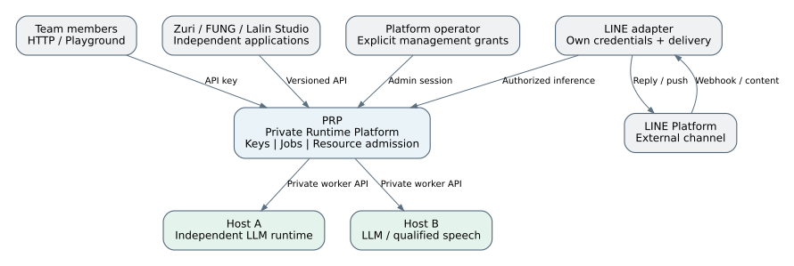

[Editable source](diagrams/source/D01.dot) · [SVG](diagrams/svg/D01.svg) · [PNG](diagrams/png/D01.png)

No mandatory business application. LINE traffic is outside the private compute boundary.

## D02 — Containers and control/data planes

**Type:** C4-inspired containers | **Trace:** PRP-FR-017,042,045,050

บริการเชิงตรรกะไม่ใช่จำนวนเครื่องหรือ microservice ที่ต้องซื้อเพิ่ม

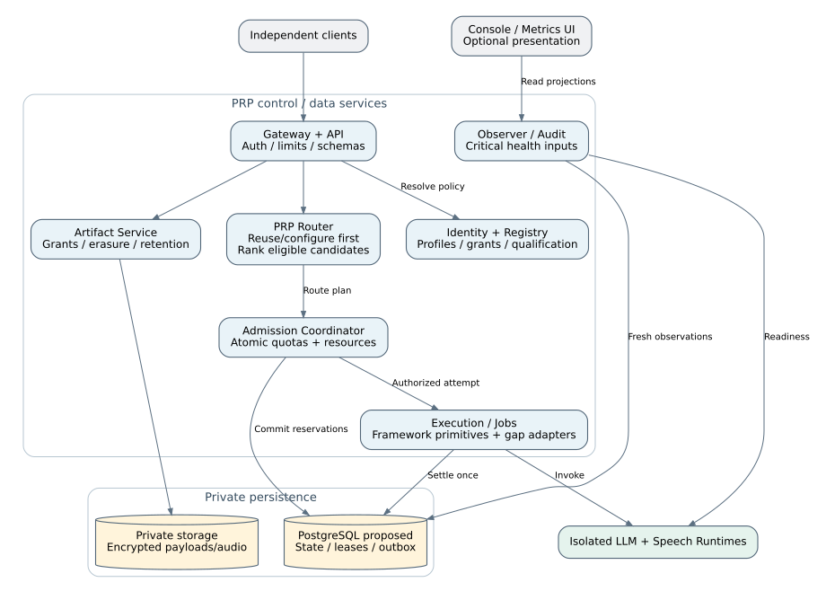

[Editable source](diagrams/source/D02.dot) · [SVG](diagrams/svg/D02.svg) · [PNG](diagrams/png/D02.png)

v0.3.0: logical ownership can be implemented by reused libraries/configuration; no automatic custom service.

## D03 — Ownership and dependency rules

**Type:** Component / package boundaries | **Trace:** PRP-FR-002,026,028,043,054; PRP-SEC-012

แบ่ง app workflow, PRP control และ model runtime; ห้าม worker ถือ LINE credential หรือ business database token

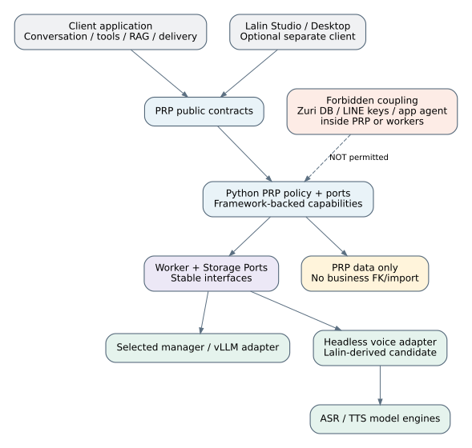

[Editable source](diagrams/source/D03.dot) · [SVG](diagrams/svg/D03.svg) · [PNG](diagrams/png/D03.png)

v0.3.0: logical ownership can be implemented by reused libraries/configuration; no automatic custom service.

## D04 — Two-host private deployment

**Type:** Deployment / network topology | **Trace:** PRP-FR-018,044,050; PRP-NFR-012

สองเครื่องไม่เท่ากับ high availability; speech แชร์ GPU เฉพาะหลัง qualification

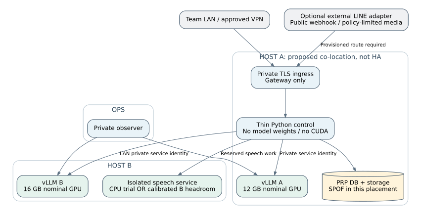

[Editable source](diagrams/source/D04.dot) · [SVG](diagrams/svg/D04.svg) · [PNG](diagrams/png/D04.png)

v0.3.0: logical ownership can be implemented by reused libraries/configuration; no automatic custom service.

## D05 — Actors and use cases

**Type:** Use-case view | **Trace:** PRP-FR-004,005,007,048

แยกสิทธิ์ operator กับ content owner; inference key ไม่ใช่ admin key

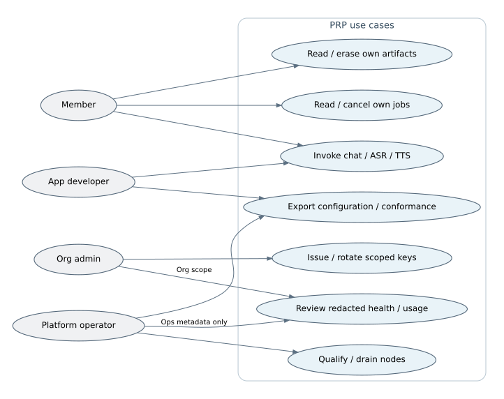

[Editable source](diagrams/source/D05.dot) · [SVG](diagrams/svg/D05.svg) · [PNG](diagrams/png/D05.png)

## D06 — Chat JSON/SSE request

**Type:** UML-style sequence | **Trace:** PRP-FR-017,024,025,027

แสดง auth, reservation, dispatch, streaming และแยก interrupted stream ออกจาก success

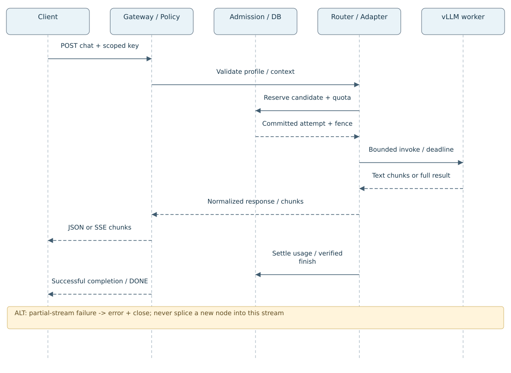

[Editable source](diagrams/source/D06.mmd) · [SVG](diagrams/svg/D06.svg) · [PNG](diagrams/png/D06.png)

[Canonical sequence JSON](diagrams/source/D06.sequence.json)

## D07 — Client-owned voice conversation

**Type:** UML-style sequence | **Trace:** PRP-FR-031..038,049

PRP มี atomic ASR/TTS; app เก็บข้อความก่อนขอเสียงและ retry เฉพาะ TTS เมื่อเสีย

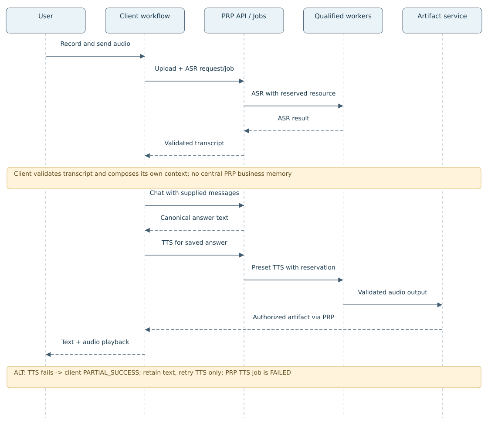

[Editable source](diagrams/source/D07.mmd) · [SVG](diagrams/svg/D07.svg) · [PNG](diagrams/png/D07.png)

[Canonical sequence JSON](diagrams/source/D07.sequence.json)

## D08 — Key issuance, use and revocation

**Type:** UML-style sequence | **Trace:** PRP-FR-005,006; PRP-SEC-002

คีย์แสดงครั้งเดียวและ revoke ตรวจใหม่ก่อน dispatch/result access

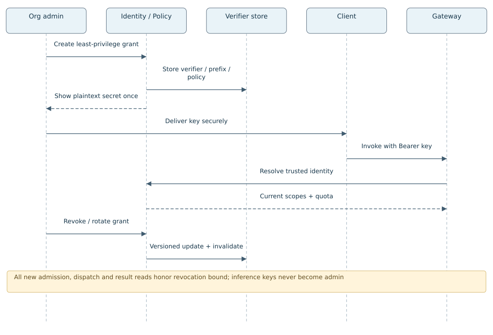

[Editable source](diagrams/source/D08.mmd) · [SVG](diagrams/svg/D08.svg) · [PNG](diagrams/png/D08.png)

[Canonical sequence JSON](diagrams/source/D08.sequence.json)

## D09 — Admission and routing activity

**Type:** Activity / decision flow | **Trace:** PRP-FR-008,016..022

Router เสนอ candidate แต่ Admission เป็นผู้จองจริง จึงป้องกัน race ข้าม process

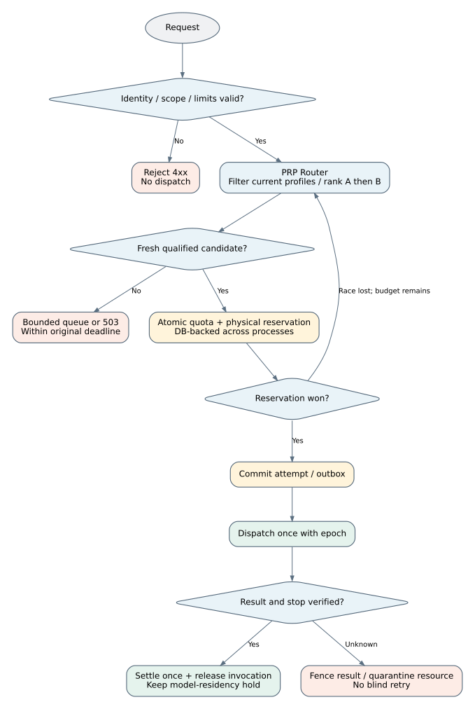

[Editable source](diagrams/source/D09.dot) · [SVG](diagrams/svg/D09.svg) · [PNG](diagrams/png/D09.png)

## D10 — Node enrollment and qualification

**Type:** UML-style sequence | **Trace:** PRP-FR-010..015,042

ไม่มี custom Edge handshake; receipt ผูก exact config/model/credential epoch

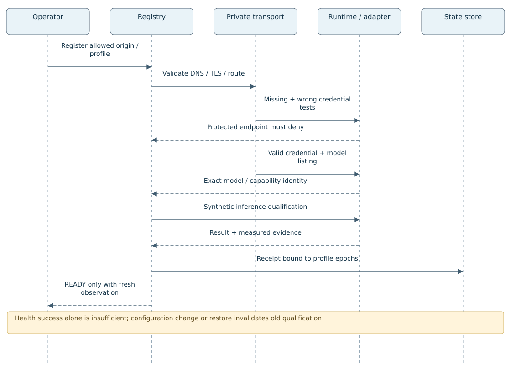

[Editable source](diagrams/source/D10.mmd) · [SVG](diagrams/svg/D10.svg) · [PNG](diagrams/png/D10.png)

[Canonical sequence JSON](diagrams/source/D10.sequence.json)

## D11 — LINE voice integration outside PRP

**Type:** UML-style sequence | **Trace:** PRP-FR-040,055

adapter ถือ webhook/delivery; PRP ไม่รับ LINE token และไม่ส่งข้อความเอง

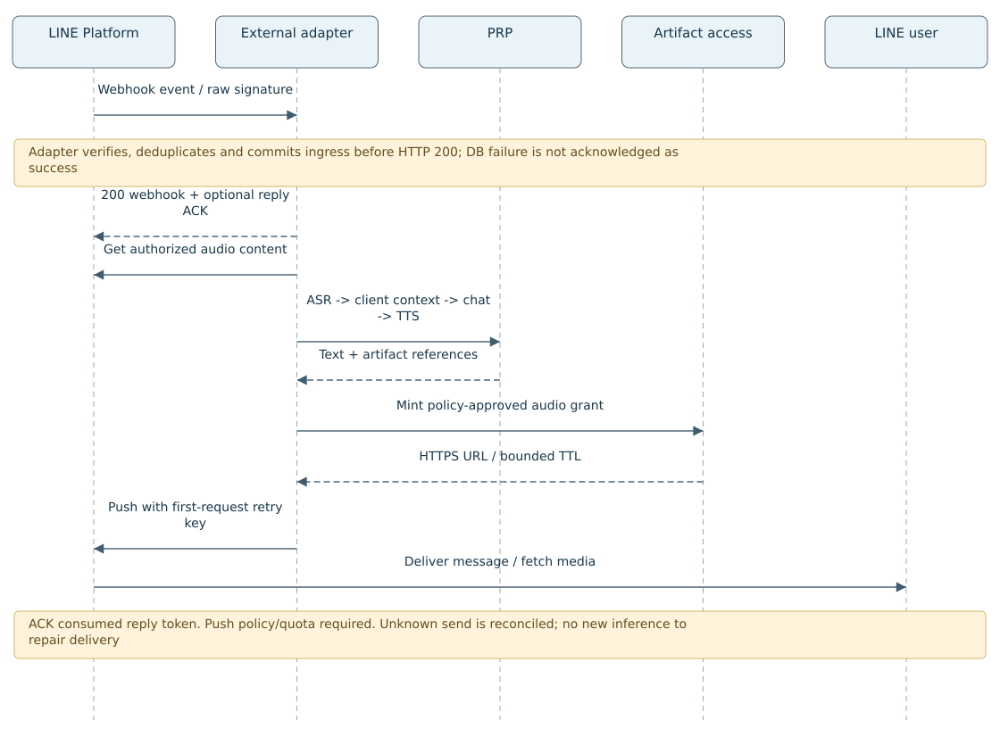

[Editable source](diagrams/source/D11.mmd) · [SVG](diagrams/svg/D11.svg) · [PNG](diagrams/png/D11.png)

[Canonical sequence JSON](diagrams/source/D11.sequence.json)

## D12 — Job state dimensions

**Type:** State machines / product state | **Trace:** PRP-FR-020,021,036..038

outcome timeout กับ execution unknown และ quarantined lease เกิดพร้อมกันได้

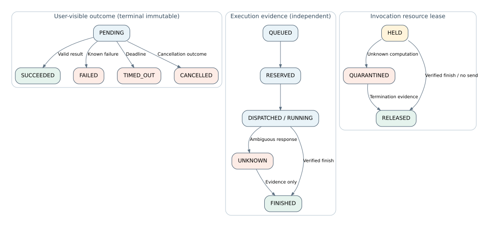

[Editable source](diagrams/source/D12.dot) · [SVG](diagrams/svg/D12.svg) · [PNG](diagrams/png/D12.png)

## D13 — Cancellation and uncertain recovery

**Type:** UML-style sequence | **Trace:** PRP-FR-020..022,041

cancel request และ timeout ไม่ใช่ compute stop; คืน lease ต่อเมื่อมีหลักฐาน

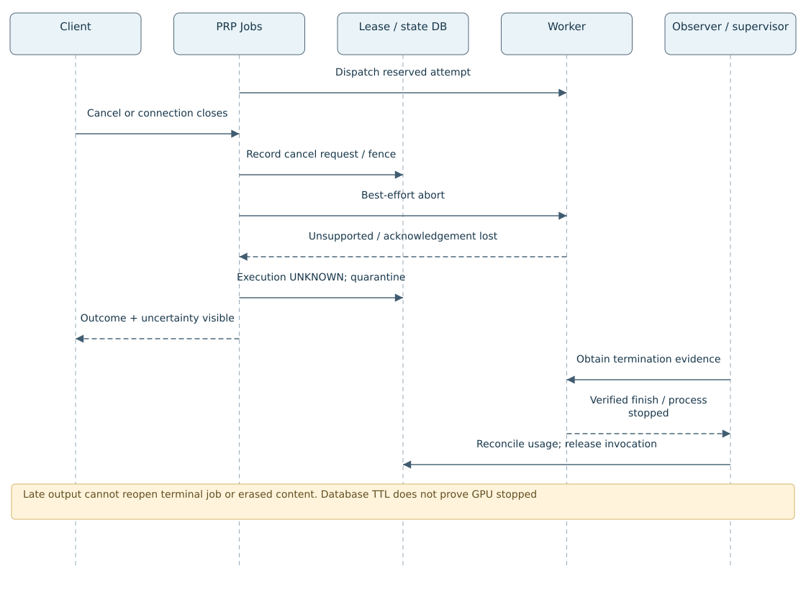

[Editable source](diagrams/source/D13.mmd) · [SVG](diagrams/svg/D13.svg) · [PNG](diagrams/png/D13.png)

[Canonical sequence JSON](diagrams/source/D13.sequence.json)

## D14 — Runtime readiness and residency

**Type:** State machine | **Trace:** PRP-FR-014,015,044

ready ต้องผ่าน qualification; model residency ไม่ผูกกับ job lifecycle

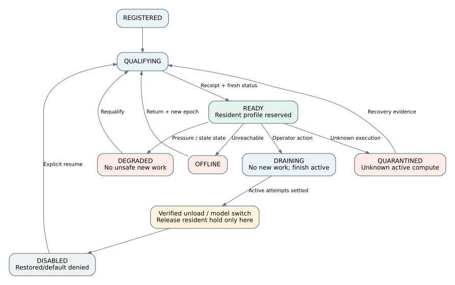

[Editable source](diagrams/source/D14.dot) · [SVG](diagrams/svg/D14.svg) · [PNG](diagrams/png/D14.png)

## D15 — External delivery lifecycle

**Type:** State machine / external integration | **Trace:** PRP-FR-055

สถานะ delivery ของ LINE adapter แยกจาก inference; API accepted ไม่เท่ากับ read

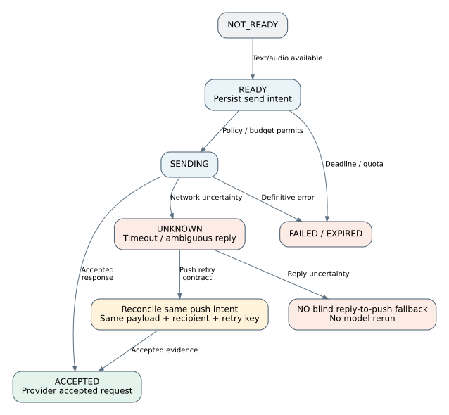

[Editable source](diagrams/source/D15.dot) · [SVG](diagrams/svg/D15.svg) · [PNG](diagrams/png/D15.png)

## D16 — Compute and job data model

**Type:** Logical ERD | **Trace:** PRP-FR-013,017,027,036..041

cardinality labels เป็น logical model; ไม่ใช่ schema migration ที่รันแล้ว

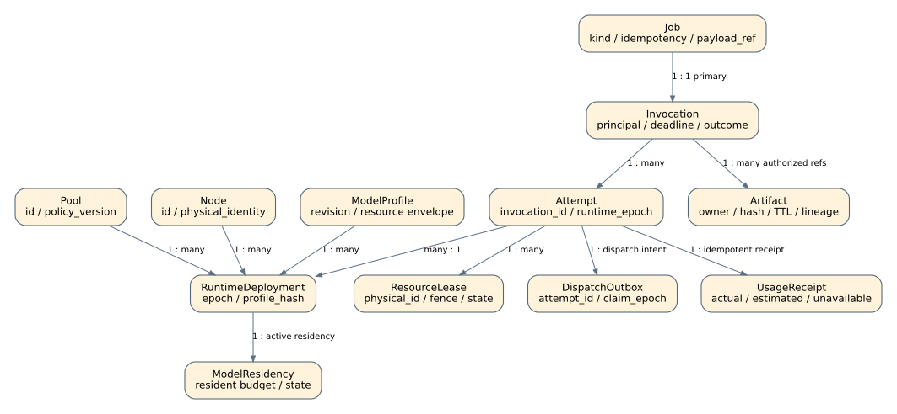

[Editable source](diagrams/source/D16.dot) · [SVG](diagrams/svg/D16.svg) · [PNG](diagrams/png/D16.png)

## D17 — Identity, keys and object grants

**Type:** Logical ERD / authorization | **Trace:** PRP-FR-003..009,038..040; PRP-SEC-004

องค์กรของ PRP เป็น boundary อิสระจาก Zuri Business; user tag ไม่ใช่สิทธิ์

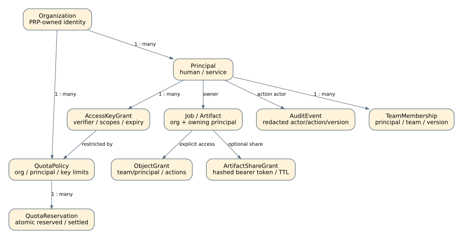

[Editable source](diagrams/source/D17.dot) · [SVG](diagrams/svg/D17.svg) · [PNG](diagrams/png/D17.png)

## D18 — Worker ports and profile contract

**Type:** UML-inspired class/interface | **Trace:** PRP-FR-011,012,042,043

เน้น interface แทน runtime-specific imports; deployment hash ตรึง capability

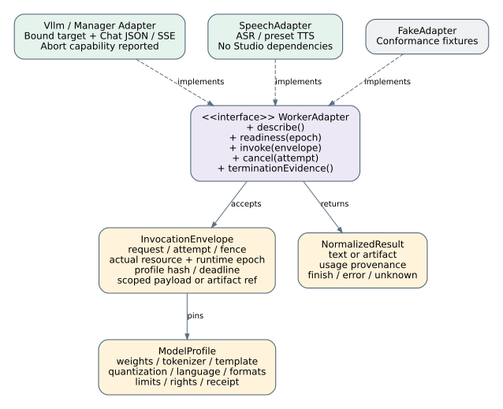

[Editable source](diagrams/source/D18.dot) · [SVG](diagrams/svg/D18.svg) · [PNG](diagrams/png/D18.png)

v0.3.0: logical ownership can be implemented by reused libraries/configuration; no automatic custom service.

## D19 — Audio artifact lifecycle and lineage

**Type:** Data-flow + lifecycle | **Trace:** PRP-FR-028..030,039..041

retention, erase และ share grant มีขอบเขตต่างจากสำเนาที่ client/LINE ดาวน์โหลดแล้ว

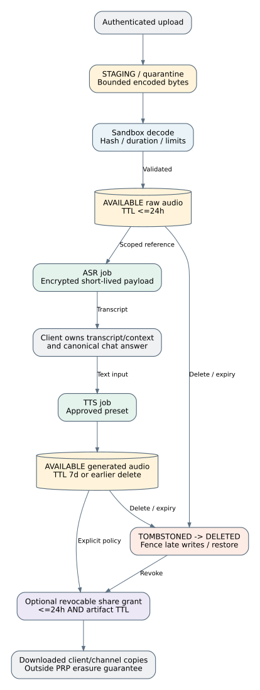

[Editable source](diagrams/source/D19.dot) · [SVG](diagrams/svg/D19.svg) · [PNG](diagrams/png/D19.png)

## D20 — Trust boundaries and threat controls

**Type:** Trust-boundary / DFD security | **Trace:** PRP-SEC-001..012

control worker storage และ public integration เป็นคนละ trust boundary

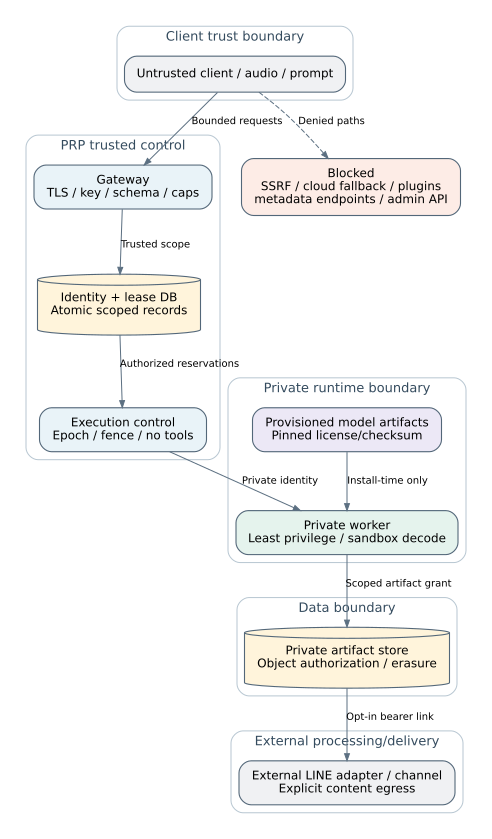

[Editable source](diagrams/source/D20.dot) · [SVG](diagrams/svg/D20.svg) · [PNG](diagrams/png/D20.png)

## D21 — Observability and operational loop

**Type:** Telemetry / control-flow | **Trace:** PRP-FR-014,045..047

observer ใช้ admission ส่วน dashboard เป็น projection ที่ถอดออกได้

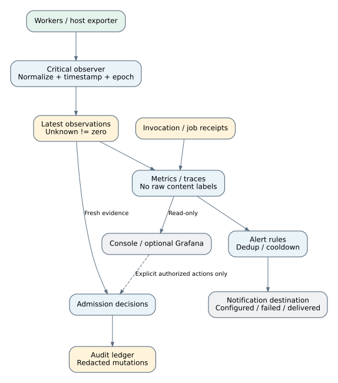

[Editable source](diagrams/source/D21.dot) · [SVG](diagrams/svg/D21.svg) · [PNG](diagrams/png/D21.png)

## D22 — Disaster restore and erasure reconciliation

**Type:** Recovery activity | **Trace:** PRP-FR-041,051; PRP-NFR-012

RPO/RTO เป็น targets; restore ไม่เปิด node/grant จาก snapshot ทันที

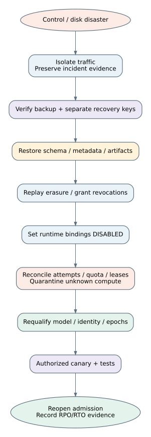

[Editable source](diagrams/source/D22.dot) · [SVG](diagrams/svg/D22.svg) · [PNG](diagrams/png/D22.png)

## D23 — Release pipeline and rollback

**Type:** CI/CD / release gates | **Trace:** PRP-FR-050..053; PRP-SEC-010

เอกสาร source กับ test evidence แยกกัน; production activation ไม่เกิดจาก docs build

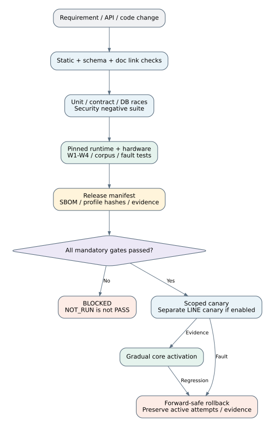

[Editable source](diagrams/source/D23.dot) · [SVG](diagrams/svg/D23.svg) · [PNG](diagrams/png/D23.png)

## D24 — Phase 2 media extension

**Type:** Workflow / extensibility | **Trace:** PRP-P2-001..008; PRP-FR-056

ภาพและวิดีโอใช้ primitives เดิม แต่มี grants, units, profiles และ quality gates ใหม่

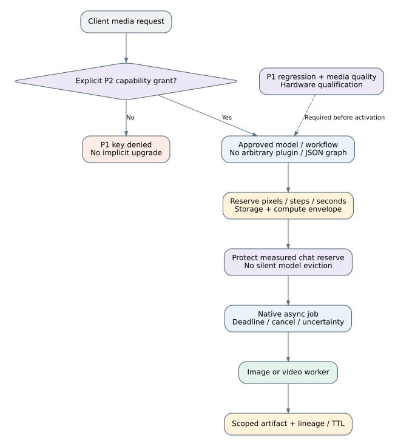

[Editable source](diagrams/source/D24.dot) · [SVG](diagrams/svg/D24.svg) · [PNG](diagrams/png/D24.png)

## D25 — Failure and risk coverage

**Type:** Fault tree / verification map | **Trace:** PRP-NFR-001..018; PRP-FR-020,051

root cause หลายแบบทำให้งานล้มเหมือนกัน จึงต้องรายงานแยกและมีหลักฐาน

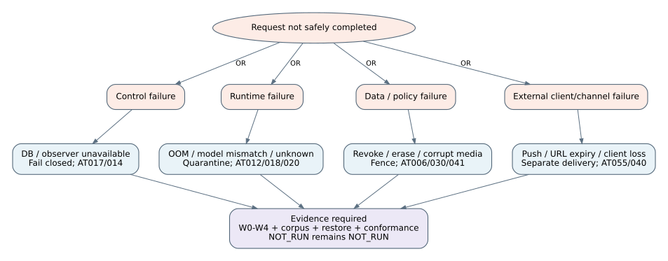

[Editable source](diagrams/source/D25.dot) · [SVG](diagrams/svg/D25.svg) · [PNG](diagrams/png/D25.png)

## D26 — Requirement-to-evidence traceability

**Type:** Traceability dependency graph | **Trace:** PRP-FR-053; all requirement families

เอกสาร derived ไม่เป็น requirement source อีกชุด; code/test links ต้องมีจริงก่อนใส่ PASS

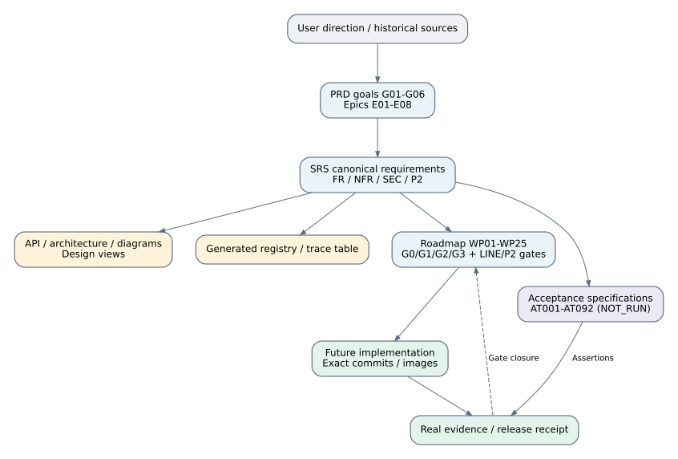

[Editable source](diagrams/source/D26.dot) · [SVG](diagrams/svg/D26.svg) · [PNG](diagrams/png/D26.png)

## D27 — Roadmap dependencies and parallel lanes

**Type:** Roadmap / dependency DAG | **Trace:** Roadmap WP01..WP25; PRP-NFR-019..024

ลำดับตาม gate ไม่สมมติวันเสร็จ; LINE acceptance แยกจาก core pilot

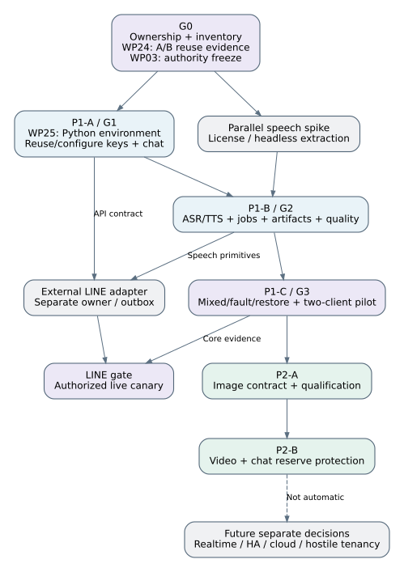

[Editable source](diagrams/source/D27.dot) · [SVG](diagrams/svg/D27.svg) · [PNG](diagrams/png/D27.png)

v0.3.0: logical ownership can be implemented by reused libraries/configuration; no automatic custom service.

## D28 — Console and playground navigation

**Type:** UX navigation / sitemap | **Trace:** PRP-FR-048,049

หน้าจอเป็น client ผ่าน API ไม่ฝัง business state เข้า core

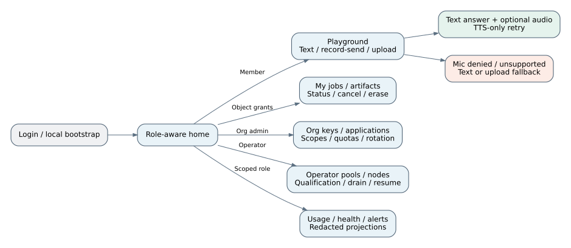

[Editable source](diagrams/source/D28.dot) · [SVG](diagrams/svg/D28.svg) · [PNG](diagrams/png/D28.png)

## D29 — Resident memory versus invocation leases

**Type:** Resource-allocation lifecycle | **Trace:** PRP-FR-013,018,044

จบงานไม่ได้ทำให้น้ำหนักโมเดลหายจาก VRAM; ติดตามคนละ lifecycle

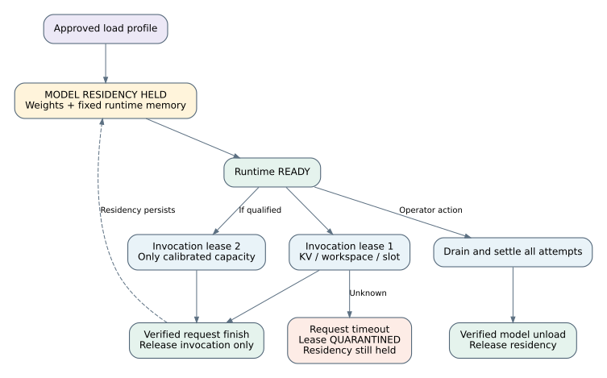

[Editable source](diagrams/source/D29.dot) · [SVG](diagrams/svg/D29.svg) · [PNG](diagrams/png/D29.png)

## D30 — Repository and package direction

**Type:** Package dependency diagram | **Trace:** PRP-FR-001,002,043,050,053; PRP-NFR-019,021,022

ชื่อ path เป็นข้อเสนอ ไม่ใช่ไฟล์ที่สร้างใน GitHub; หลีกเลี่ยง import จาก Zuri

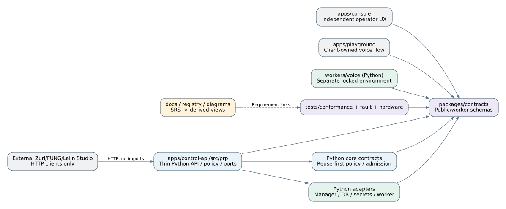

[Editable source](diagrams/source/D30.dot) · [SVG](diagrams/svg/D30.svg) · [PNG](diagrams/png/D30.png)

v0.3.0: logical ownership can be implemented by reused libraries/configuration; no automatic custom service.

## D31 — Reuse-first framework evaluation

**Type:** Decision / evaluation DAG | **Trace:** PRP-NFR-020; WP24/WP03

เปรียบเทียบ A/B ก่อนเลือก stack; source review ไม่เท่ากับ runtime PASS และ critical gap ห้ามถูกคะแนนรวมกลบ

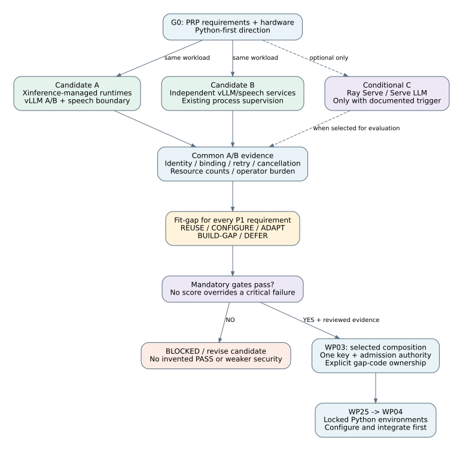

[Editable source](diagrams/source/D31.dot) · [SVG](diagrams/svg/D31.svg) · [PNG](diagrams/png/D31.png)

Design proposal. Framework conformance and runtime tests: NOT_RUN.

## D32 — Python API and model process isolation

**Type:** Process / deployment boundaries | **Trace:** PRP-NFR-019,021,022

Python-first แต่ไม่ใช่ single process: เพิ่ม API workers ต้องไม่เพิ่มจำนวนโมเดลหรือ CUDA residency

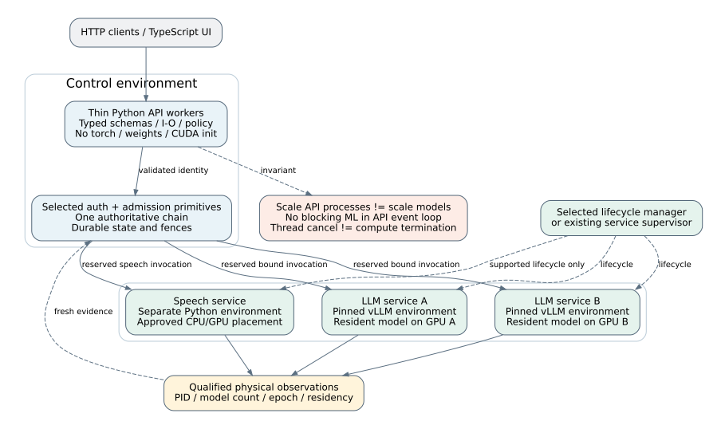

[Editable source](diagrams/source/D32.dot) · [SVG](diagrams/svg/D32.svg) · [PNG](diagrams/png/D32.png)

Design proposal. Framework conformance and runtime tests: NOT_RUN.

## D33 — Framework delegation without authority bypass

**Type:** Authority / admission flow | **Trace:** PRP-NFR-023; PRP-FR-005,017,018

ใช้ key/router/manager ที่มีอยู่ได้ แต่ทุกการส่งงานต้องผ่านสิทธิ์และ lease เดียวกัน ไม่มี hidden retry/reroute

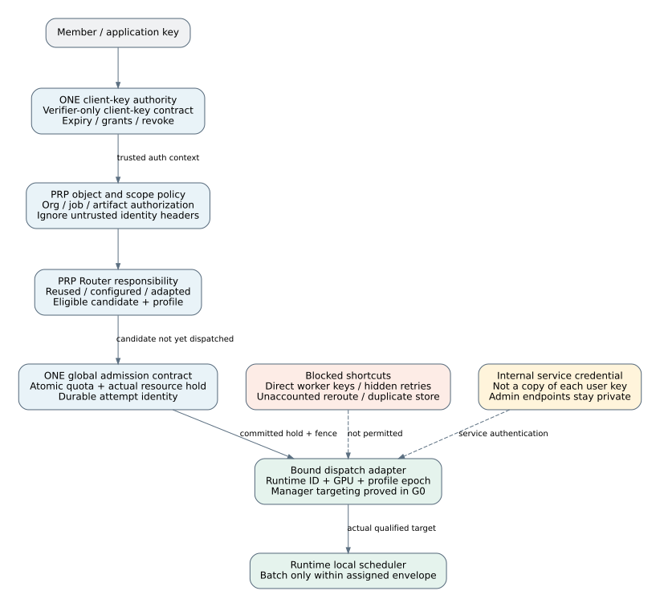

[Editable source](diagrams/source/D33.dot) · [SVG](diagrams/svg/D33.svg) · [PNG](diagrams/png/D33.png)

Design proposal. Framework conformance and runtime tests: NOT_RUN.

## D34 — Runtime manager binding and safe lifecycle

**Type:** UML-style sequence | **Trace:** PRP-NFR-024; PRP-FR-011,015,020,042,044

การจัดการ runtime ผ่าน adapter ต้องผูก actual resource/epoch ก่อน ready และก่อน dispatch; เป็น proposed contract ไม่อ้าง vendor รองรับแล้ว

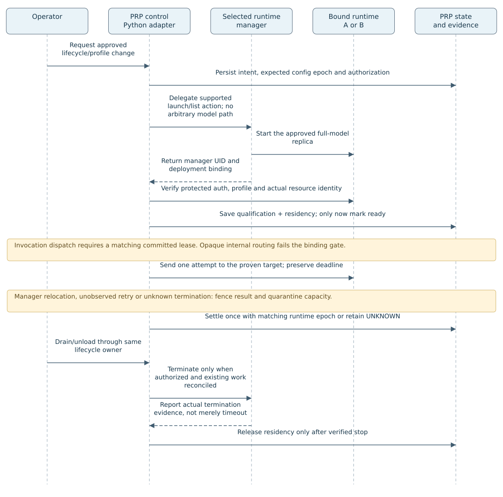

[Editable source](diagrams/source/D34.mmd) · [SVG](diagrams/svg/D34.svg) · [PNG](diagrams/png/D34.png)

Design proposal. Framework conformance and runtime tests: NOT_RUN.

[Canonical sequence JSON](diagrams/source/D34.sequence.json)
