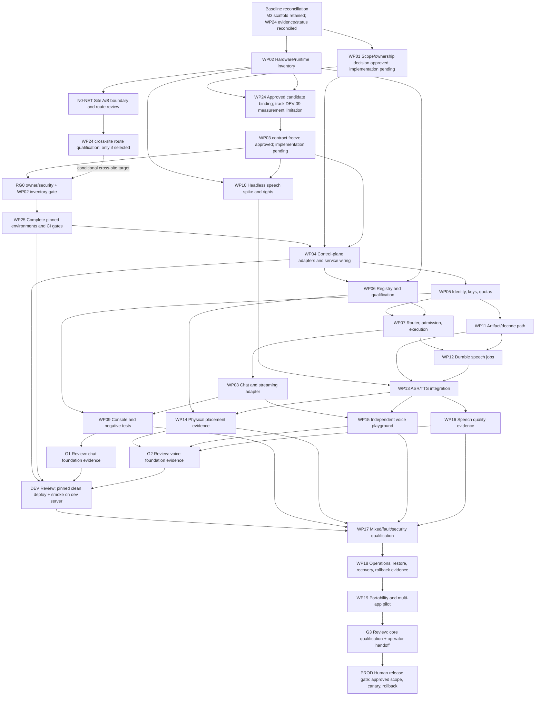

# Execution DAG | PRP Implementation through Production

**PRP — Private Runtime Platform | v0.5.0-draft | 2026-10-04 | APPROVED by the repository owner**

**Complexity / risk:** C-3 / HIGH
**Related:** [Roadmap](ROADMAP-PRP.md) · [SRS](SRS-PRP.md) · [Verification plan](TEST-PRP.md) · [Operations](OPS-PRP.md) · [Execution Governance](standards/STD-Execution-Governance.md)

## 1. Objective and scope

Define a dependency-safe, parallel implementation path from the current M3 skeleton through G0, P1 chat and voice, development-server validation, G3 core qualification, and the production release gate. This is an implementation plan, not implementation approval, deployment authorization, or evidence that any runtime gate passed.

LINE canary and P2 image/video remain separate follow-on tracks. They do not block the core production gate unless the approved product scope includes them.

## 2. Current baseline and entry conditions

- M1–M3 and the Python skeletons exist. `apps/control-api` has contract-bound routes but no adapters; requests fail closed with `503 STATE_STORE_UNAVAILABLE`. `workers/voice` has the worker contract and lifecycle skeleton but no speech engine. Preserve these seams; do not regenerate the skeleton from scratch.
- WP24 run 1's approved receipt selects candidate A and satisfies the WP24 decision prerequisite for WP03. Run 2 is supplemental measurement only and does not reopen that decision; DEV-09 remains a limitation on cross-candidate cache/concurrency comparison. The WP01 scope/ownership decision receipt was approved 2026-09-30; WP01 implementation remains `NOT_STARTED`.
- The owner approved the WP03 contract freeze on 2026-09-30; worker and management contracts are `0.4.0` / `FROZEN` under [the freeze receipt](../.brain/proposals/PROP-2026-09-30-wp03-formal-contract-freeze.md). The public client contract remains proposed at `0.3.0` / `DRAFT` and outside this freeze; its approval or freeze needs a separate owner decision. WP02 has a current Host B snapshot and an owner-provided Host A inventory summary ([Host A report](evidence/wp02/WP02-2026-10-04-host-a-reported-inventory.md)); Host A's raw files are not in this checkout. The owner confirms the hosts are at separate locations and on separate networks; exact route/boundary remains unverified, so cross-site WP24 qualification is blocked pending `N0-NET`. The prior one-shot Host B→Host A ICMP/TCP probe via Host B's default gateway is inconclusive about routing vs filtering. RG0 also needs remaining entry evidence. No WP25/WP04 implementation may start before RG0. All 94 acceptance cases remain `NOT_RUN`; WP01/WP03 approval does not constitute runtime implementation or acceptance evidence.
- The roadmap now records the approved WP24 decision receipt separately from implementation status. Keep work-package implementation statuses `NOT_STARTED` until implementation evidence exists; do not infer PASS from files existing.

Sources: `apps/control-api/README.md`; `workers/voice/README.md`; `docs/CHANGELOG-PRP.md` (M3 and WP24 entries); `docs/evidence/wp24/WP24-2026-09-24-run2/A/FINDINGS.md`; `docs/TEST-PRP.md` §1.

## 3. Proposed execution DAG

The Mermaid graph retains the existing WP IDs. G1 and G2 may progress in parallel after their shared contracts and admission seams are frozen; DEV waits for both evidence joins. G3 is qualification, not production authorization.

## 4. Parallel worker lanes

Use up to three concurrent **GPT-6 Luna Max** worker lanes (`gpt-6-luna`, reasoning effort `max`). Each task has one bounded owner, one branch/PR, named file ownership, approved source references, acceptance IDs, and evidence expectations.

| Lane | Work | Earliest start | Parallel boundary |
|---|---|---|---|
| A — Control | WP04 → WP05 → WP07 → WP08 → WP09 | After RG0; each edge still gates its dependent task | Own control-plane paths; shared identity/state contracts and migrations are coordinated and serialized |
| B — Fleet/runtime | WP06; then integrate with WP07 | After WP04 and WP02 | Own fleet/qualification adapter paths; do not change resource budgets without the integrator |
| C — Speech | WP10 can start after WP02/WP03; WP11 after WP05; WP12 after WP07/WP11; WP13 after WP10/WP11/WP12; WP14/15/16 fan out after WP13 | WP10 may overlap Lane A after contract freeze | Separate speech worker, artifacts, UI, and corpus paths; voice/model activation waits for rights and hardware evidence |

Generated contracts, shared schema migrations, runtime ports, and resident GPU budgets have a single named integrator. Contract changes are authored once in canonical YAML; derived JSON/models/registries are regenerated and reviewed as one controlled change. A worker may not change acceptance status without a matching evidence receipt.

## 5. Review gates and human authority

Use an independent GPT-6 Luna Max review instance at RG0, WP25, G1, G2, DEV, G3, and PROD. The reviewer receives the approved source clauses, diff, test results, and collected receipts; it must not review its own implementation task. Findings are returned to the worker/integrator for correction before the gate join.

Model review is advisory. Human authority remains with:

- Product/Architecture/Security owners for scope, selected authority, secret design, security and rights decisions at G0/WP03.
- Operations/QA for actual host inventory, physical placement, runtime measurements, and restore evidence.
- The development-server owner for access and deployment authorization at DEV.
- The release owner/operator for production configuration, canary, monitoring, rollback, and release signoff at PROD.

No model may select a production runtime, approve license rights, authorize access to an external server, issue real credentials, or sign off production.

## 6. Gate exit evidence

- **WP03 contract decision:** owner-approved scope/authority, WP24 disposition, and frozen worker/management API/state/error/retry/cancel contracts are recorded in the WP03 freeze receipt. This closes the contract decision only.
- **RG0 implementation entry:** WP03 freezes the approved contract-level admission/key-authority chain and secret/rights design; RG0 still requires complete hardware/runtime inventory from WP02 and evidence that the approved design is ready for the selected environment. WP02 discovery is partial: [Host B has a dated current snapshot](evidence/wp02/WP02-2026-10-03-host-b-current.md), and [Host A has an owner-provided inventory summary](evidence/wp02/WP02-2026-10-04-host-a-reported-inventory.md) whose raw files are not in this checkout. The owner confirms separate locations/networks, but the approved boundary and any route remain unresolved; the described arrangement does not satisfy the WP24 same-LAN experiment precondition. The one-shot Host B→Host A probe via the default gateway did not connect but does not establish why. Inventory is not host/runtime qualification evidence. Secret-store topology and model/voice license receipts remain their later gates. No adapter implementation, WP25, or WP04 work starts until RG0 is satisfied.
- **WP25:** exact Python/toolchain and separate control/LLM/speech locks or image boundaries; clean install; CPU-only control import/health proof; CI gates and generated-contract consistency.
- **G1:** two qualified replicas; clean install; JSON/SSE compatibility; identity and key isolation; wrong/missing-auth refusal; atomic admission/race and resource dedupe; bounded queue; stream interruption; no unapproved egress; revoke evidence.
- **G2:** licensed model/voice receipts; approved preset; bounded upload/decode and artifact ACL/erasure; durable job/idempotency/cancel/recovery evidence; safe placement; independent client cycle; SRS/TEST speech corpus thresholds and scorer receipts.
- **DEV:** clean deploy from pinned artifacts; exact commit/image/profile and environment recorded; health/readiness, contract/integration/security smoke; known blockers reviewed. Include a small deploy-revert instruction in this gate packet. Do not require WP18's later restore/rollback evidence before DEV.
- **G3:** W0–W4 under the approved profile; mixed chat/voice protection; fault/security evidence; no admitted OOM; restore with erasure reconciliation; two-client isolation; portability/key rotation; operator handoff.
- **PROD:** every SRS §14 production decision resolved; approved production config and release packet; backup/restore proof; one-scope synthetic or authorized non-sensitive canary; monitoring and rollback evidence; release owner/operator signoff. LINE live canary remains separately authorized.

Test status changes require evidence receipts through `tools/trace/collect_trace.py`; otherwise cases remain `NOT_RUN` or `BLOCKED`. A passing document validator, local unit test, or model review is not runtime qualification.

## 7. Roadmap consistency correction applied

The approved roadmap initially required deployment/rollback runbooks from WP18 at DEV, while WP18 depends on WP17 and the roadmap places DEV before WP17/G3. That edge created a dependency cycle.

**Root cause:** the plan combines the short instructions needed to deploy/revert a dev build with WP18's full restore, recovery, and release rollback evidence.

**Correction applied:** the DEV gate owns a short deploy/revert instruction based on WP04/WP25 artifacts; WP18 remains after WP17 for full restore, recovery, and release evidence. WP IDs are unchanged. The root cause and prevention are recorded in [RCA-2026-09-29-roadmap-dev-wp18-cycle](../.brain/rca/RCA-2026-09-29-roadmap-dev-wp18-cycle.md).

WP24 implementation may remain `NOT_STARTED`: the approved run 1 decision receipt satisfies its WP03 decision prerequisite, while run 2 is measurement-only. No WP24 status discrepancy remains to reconcile at preflight. Do not infer implementation PASS or change any acceptance case from this receipt.

## 8. Definition of done for this plan

1. Owner approval recorded; this DAG is canonical under `docs/`, and the roadmap, index, RCA, and changelog are updated before dispatch.
2. The DAG is acyclic; every worker task has a frozen dependency, bounded paths, test IDs, evidence receipt, and named reviewer.
3. G0/WP03 approvals are recorded before implementation work begins.
4. Gate statuses move only with evidence and the accountable human signoff listed above.
5. DEV is completed and reviewed before G3; G3 is completed and reviewed before PROD authorization.

No implementation, server access, deployment, credentials, or production activity is authorized by this proposal alone.
