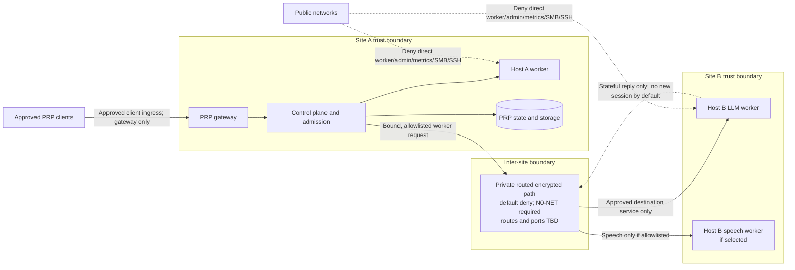

# Network Boundary | Cross-site routes and qualification

เอกสารนี้กำหนดแบบสถาปัตยกรรมแบบมีเงื่อนไขสำหรับ compute hosts ที่อยู่คนละสถานที่ โดยกำหนดและทบทวน trust boundary กับเส้นทางก่อนเปิดการเชื่อมต่อจริง การอนุมัติเอกสารนี้ไม่อนุมัติให้ตั้ง VPN, firewall, route, port-forward หรือเริ่ม runtime test

**PRP — Private Runtime Platform | v0.1.0 | 2026-10-04 | Approved design with route-specific gates**

เอกสารที่เกี่ยวข้อง: [SRS](SRS-PRP.md) · [Architecture](ARCH-PRP.md) · [Security & Data](SECURITY-DATA-PRP.md) · [WP24 procedure](WP24-EXPERIMENT-PROCEDURE.md) · [Operations](OPS-PRP.md)

## 1. Assumptions and current evidence

1. เจ้าของยืนยันเมื่อ 2026-10-04 ว่า Host A และ Host B อยู่คนละสถานที่และคนละเครือข่าย
2. หลักฐาน WP02 ระบุ hostname ที่คาดว่าเป็น Host A แต่ยังไม่ยืนยันการผูก Host A/B กับ topology ปัจจุบันครบถ้วน
3. ยังไม่มีหลักฐาน route/tunnel ที่อนุมัติ, exact CIDR, NAT, port, route owner หรือ endpoint reachability
4. `VPN` หรือ `private TLS` เป็นเพียงชนิดทางเลือกใน ARCH ปัจจุบัน ไม่ใช่หลักฐานว่ามีเส้นทางถึง worker หรือว่าขอบเขตปลอดภัยแล้ว
5. WP24 run ที่อนุมัติ Candidate A ไม่ได้พิสูจน์การเชื่อมต่อข้ามไซต์; procedure ปัจจุบันกำหนด LAN เดียวและ LAN-only

Evidence: [WP02 Host A report](evidence/wp02/WP02-2026-10-04-host-a-reported-inventory.md), [SRS §2](SRS-PRP.md), [ARCH §4](ARCH-PRP.md), [WP24 procedure §2](WP24-EXPERIMENT-PROCEDURE.md), and [execution DAG §2](EXECUTION-DAG-PRP.md).

## 2. Confirmed documentation gap

The approved SRS deployment context and WP24 experiment precondition say the two compute hosts share one LAN. ARCH §4 separately allows remote teams to use approved VPN/private TLS, but does not define an inter-site worker route, route ownership, traffic allowlist, or qualification evidence. The currently owner-described placement therefore does not satisfy WP24's network precondition. A tunnel or successful ping alone must not be treated as resolving this gap.

## 3. Approved conditional topology

The repository owner approved a **conditional, vendor-neutral, private routed link** as a candidate deployment topology for A/B workers in different sites, subject to the Network Boundary Review gate (`N0-NET`). The logical route may carry only explicitly approved PRP control/worker traffic. The current same-LAN WP24 evidence remains valid only for the environment and scope actually recorded in that evidence.

Keep these decisions open until the boundary record is complete and reviewed:

- which physical host and network are Site A and Site B;
- site CIDRs, host addresses or stable DNS names, gateways, NAT and current interfaces;
- route prefixes, initiating direction, exact services/protocols/ports, and responsible router/firewall owners;
- transport encryption, peer/service authentication, certificate or key custody and rotation;
- DNS behavior, egress policy, monitoring, failover and route revocation behavior.

No VPN product, public address, CIDR, port number, router, firewall rule, cloud relay or provider is selected here.

## 4. C-3 target view

The diagram separates client ingress from the A-to-B worker path. It is an approved logical target view: arrows do not assert that any route currently exists, and the allowlist, addressing and port values remain unfilled until `N0-NET` passes.

The A-to-B network path does not replace worker TLS/service identity, PRP admission and actual-resource binding. The client path terminates at the gateway and is reviewed separately. Optional LINE webhook or artifact-share ingress remains separately provisioned and cannot create a route to worker/admin interfaces.

## 5. N0-NET boundary record and review gate

Before any route/firewall/tunnel configuration or cross-site runtime probe, create a redacted, versioned boundary record. Never place private keys, passwords, reusable tokens or unredacted secret material in the record.

| Record section | Required fields |
|---|---|
| Sites and ownership | Site IDs; host ID/name binding; network and gateway owners; evidence timestamp; current interface/index; network profile; inventory source and reviewer |
| Addressing and routing | Site CIDRs; stable host addresses/DNS; route prefixes; next hop; NAT/PAT; gateway/firewall layers; overlapping CIDR check; route lifecycle and removal owner |
| Explicit flow matrix | Source identity/address; destination identity/address; initiator; service; protocol/port; purpose/data class; allow/deny; stateful reply behavior; enforcement point and owner |
| Identity and protection | Link encryption; authenticated peer identity; application TLS/service identity; certificate/key references and custodians; rotation/revocation procedure; DNS resolution and rebinding controls |
| Egress and exposure | Default-deny statement; approved provisioning exceptions; telemetry/inference egress; public ingress inventory; explicit denial of unapproved worker/admin/metrics/filesystem routes |
| Operations and failure | Monitoring owner; sanitized logs; latency/loss/throughput measurement plan; disconnect/revoke behavior; route-change invalidation; rollback/removal procedure |
| Review evidence | Network owner for each site, Operations, Security and Architecture review; dated decisions; allowed-path and denied-path evidence; unresolved findings and disposition |

`N0-NET` passes only when both site owners and Operations, Security and Architecture have reviewed the same record; no field needed to determine trust or reachability is `UNKNOWN`; the flow matrix is default-deny and least-privilege; overlapping CIDRs and DNS/NAT behavior are resolved; and each flow has an accountable enforcement point. Approval of this record permits only the separately authorized, recorded configuration step; it is not a production release decision.

After configuration, a separate qualification must prove the allowed path, deny unauthorized source/destination/service/direction, verify TLS and service identity, confirm that worker/admin/metrics/SMB/SSH are not publicly or broadly reachable, and capture egress on happy and failure paths. A path loss, route change, identity change or boundary-record revision invalidates the route qualification and blocks new dispatch until re-review. No hidden retry, public fallback or unbound relocation is allowed.

## 6. Options reviewed

| Option | Effect | Assessment |
|---|---|---|
| Keep hosts on one controlled LAN for WP24 | Retains current experiment contract and requires no cross-site route | Valid fallback for WP24; does not qualify the currently described cross-site deployment |
| Permit private routed inter-site path after `N0-NET` | Makes cross-site operation possible while preserving explicit boundaries and qualification | **Approved conditional candidate**, subject to the reviewed record and test evidence |
| Expose worker/admin ports through public port-forward or broad inbound tunnel | Creates direct public or overly broad reachability | Reject for this baseline; no worker, admin, metrics, SMB or SSH public exposure |

The approved option is the second one, limited to a gated candidate. A private routed path is not automatically trusted; network ACLs, host firewalls, service identity, TLS, egress and negative tests remain independent controls.

## 7. Canonical document integration

| Document/artifact | Integrated change | Boundary retained |
|---|---|---|
| `docs/SRS-PRP.md` | Cross-site hosts require a reviewed private route; NFR-025 adds route qualification. | SRS remains requirement authority; no public API change. |
| `docs/SECURITY-DATA-PRP.md` | Site/transit trust boundaries, threat TH16 and SEC-013. | Overall status remains `draft-for-review`; no hostile-host isolation or deployed-security claim. |
| `docs/ARCH-PRP.md` | Separate client ingress, control-to-worker traffic and operations; route changes invalidate qualification. | Candidate A remains conditional; no automatic HA or tensor parallelism. |
| D04 and its source/derived views | Show separate sites, gated routed path and deny-by-default boundary. | D04 remains the topology diagram. |
| WP24 procedure and run-record template | Add a cross-site profile gated by N0-NET and route evidence. | Existing run records remain unchanged; a new run is required for cross-site claims. |
| TEST, OPS, ROADMAP and EXECUTION-DAG | Add route acceptance cases, operating checklist and gate dependencies. | All runtime tests remain `NOT_RUN`; WP02/RG0 implementation gates remain open. |
| Registry, traceability and changelog | Add NFR-025, SEC-013 and their separate tests and mappings. | SRS/security remain canonical; derived views are checked against them. |

Approved stable IDs: `PRP-NFR-025`, `PRP-SEC-013`, `PRP-AT-093` and `PRP-AT-094`. NFR-025 and SEC-013 have separate acceptance cases to preserve the repository's one-test-per-requirement trace rule. Both cases remain `NOT_RUN`.

## 8. Execution sequence and exit criteria

1. Reconcile WP02 host/site identity and current inventory → verify both source records and record unresolved fields.
2. Populate the redacted boundary record and flow matrix → verify no secret material and no unknown boundary-critical fields.
3. Independent Network/Operations/Security/Architecture review (`N0-NET`) → verify dated approval and disposition of every finding.
4. Only after N0-NET, separately authorize configuration and perform allowed/denied route checks → verify path, identity, ACL, egress and failure behavior.
5. Run cross-site WP24 qualification → verify same pinned model/profile, actual resource binding, latency/loss evidence and renewed worker qualification.
6. Reassess RG0 with the new evidence → existing RG0, WP25, implementation, DEV and PROD gates remain independent.

The conditional topology and listed document scope are approved. Exit for a future cross-site qualification requires the boundary record to pass N0-NET and the corresponding new test/run evidence to be reviewed. That qualification has not occurred.

## 9. Risk, scope and version record

**Risk: HIGH.** The change expands a network trust boundary, changes the deployment topology requirement and adds a security qualification gate. Review must include the parent SRS/architecture and peer security/operations/WP24/test artifacts.

**Out of scope:** selecting a VPN/vendor, discovering or publishing WAN addresses, changing routes/firewalls/DNS, enabling SSH/SMB, port-forwarding, running remote probes, changing API schemas, implementing adapters, runtime qualification, DEV deployment or production approval.

| Artifact | Before | Integrated state |
|---|---|---|
| This document | Draft `0.1.0-proposed` in `.brain/proposals/` | Canonical `0.1.0`, `approved` |
| Canonical requirements/docs/views | Prior `0.3.0`/`0.4.0-draft` baselines | Updated per §7; derived registry and diagram views reconciled |
| Network configuration and runtime evidence | Route/boundary unverified; cross-site qualification not established | Unchanged; `NOT_RUN`; N0-NET route record and runtime qualification remain pending |

## 10. Owner decision and remaining gates

The repository owner approved the conditional topology and document scope in this revision on 2026-10-04. That approval authorizes the documentation changes listed in §7 only. It does not authorize network configuration, route probes, runtime qualification, DEV deployment or production release, and it does not waive RG0 or other release gates.
