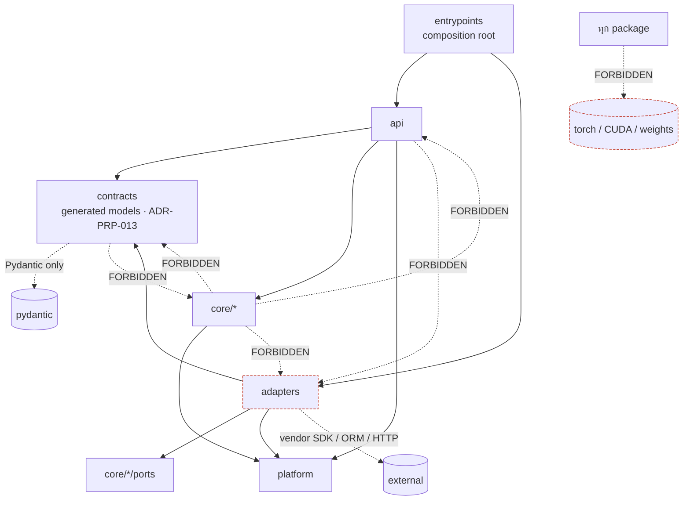
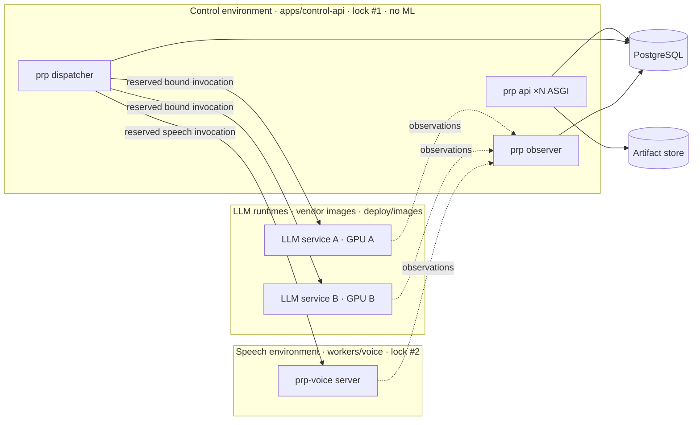

# SDD | โครงสร้าง repository, เอกสาร และ code ของ PRP

**PRP — Private Runtime Platform | v0.4.0-draft | 2026-09-20 | APPROVED 2026-09-20 โดย owner ทั้ง 6 ประเด็นใน §12 ตามข้อเสนอ; M1–M3 เสร็จ 2026-09-20; ADR-PRP-013 (generated contract models) ผสานแล้ว; M4 รอ WP24**

เอกสารที่เกี่ยวข้อง: [ADR-PRP-012](ADR-PRP.md#ADR-PRP-012) · [ADR-PRP-013](ADR-PRP.md#ADR-PRP-013) · ARCH-PRP §2/§13/§14 · Coding-Standards §2–§10 · STD-Execution-Governance §4–§9 · D30 · D32

## 1. ขอบเขตและ authority

SDD นี้กำหนด **โครงสร้างของ repository** สามส่วน: (1) ระบบเอกสารที่มีชีวิต (living docs) และ release package ที่ frozen, (2) contracts ที่เป็น protocol source of truth, (3) โครงสร้าง Python code ของ control plane และ speech worker พร้อมกติกา dependency ระหว่างส่วน

SDD นี้ **ไม่** เลือก framework (ADR-PRP-004 ยัง OPEN), ไม่แก้ข้อความ requirement, ไม่สร้าง application code และไม่รับรอง runtime ใด ๆ ทุก path ที่เสนอเป็น target layout; การมีอยู่จริงต้องผ่าน migration ตาม §11 ทีละ PR

Requirement ที่ layout นี้ต้องรองรับโดยตรง: PRP-NFR-019 (Python-first), NFR-020 (reuse before build), NFR-021 (API/model process isolation), NFR-022 (isolated reproducible environments), NFR-023 (delegated framework conformance), NFR-024 (portable binding and exit) และ FR-005 (verifier-only client keys) ในแง่ที่ key verifier เป็น port ไม่ใช่ table ของ PRP เอง

## 2. Design drivers

| Driver | ที่มา | ผลต่อ layout |
|---|---|---|
| เอกสารเป็น canonical, code เป็น derived | DDD-METHODOLOGY-SSOT, Governance §6 | `docs/` อยู่ใน repo เดียวกับ code; ทุก module/test อ้าง requirement ID |
| Spec/RCA commit พร้อม code, หนึ่ง task ต่อ PR | Git-Standards | monorepo; `.brain/rca/` ที่ workspace root ตาม AGENTS.md R6 |
| Release package ต้องไม่ถูกแก้ | README v0.3.0, MANIFEST.sha256, QA report | `docs/releases/<package>/` immutable; แก้ได้เฉพาะ `docs/` |
| แยก lock/env ของ control, LLM, speech | Coding-Standards §7, ADR-011, NFR-022 | หนึ่ง `pyproject.toml` + `uv.lock` ต่อ project; ไม่มี uv workspace; LLM เป็น vendor image ใน `deploy/` |
| Framework objects อยู่ใน adapter เท่านั้น | Coding-Standards §2, ADR-004/010 | `core/` pure Python; `adapters/` เป็น seam A/B |
| ห้าม ML import ใน control | Coding-Standards §4, ARCH §13, NFR-021 | control-api ไม่มี ML dependency ใน lock; test บังคับ |
| Fan-out 3–5 ต่อ node | Governance §4 (W-Scale) | นับ sibling ทุกระดับ; W3 ต้องมีเหตุผลบันทึกไว้ |
| Logical module ≠ custom service | ARCH §2, ADR-010 | หนึ่ง application หลาย process (api / dispatcher / observer) ไม่ใช่ microservices |

## 3. Repository layout

```text
Private-Runtime-Platform/
├── AGENTS.md                      # working rules (คงเดิม; แก้เฉพาะ link ไป docs/standards/)
├── CLAUDE.md                      # อัปเดต path หลัง migration
├── README.md                      # ทางเข้า repo: อะไรอยู่ไหน, รัน validator อย่างไร
├── .github/workflows/             # CI: docs, contracts, control-api, voice-worker, trace
├── .brain/                        # governance memory: rca/, proposals/
├── docs/                          # living documentation (§4)
├── contracts/                     # protocol source of truth (§5)
├── apps/                          # first-party deployable applications (§6)
│   ├── control-api/               #   Python control plane
│   ├── console/                   #   optional TypeScript operator UI (P1-A ขึ้นไป)
│   └── playground/                #   optional TypeScript reference voice client (P1-B)
├── workers/                       # model-side processes ใน environment แยก (§7)
│   └── voice/                     #   Python ASR/TTS worker
├── deploy/                        # host A/B composition, pinned vendor images — TEMPLATE / NOT_QUALIFIED (§8)
└── tools/                         # repo tooling เท่านั้น ไม่ใช่ application code (§9)
    ├── docs/                      #   validate_docs, build_html_views, render_sequence, gen_registry
    ├── contracts/                 #   export_json, lint
    └── trace/                     #   collect_trace
```

**W-Scale ที่ root:** directory ที่มองเห็น 6 รายการ (`docs`, `contracts`, `apps`, `workers`, `deploy`, `tools`) = W3 ขอบล่าง ทางเลือกลดเป็น W2 คือยุบ `deploy/` เข้า `apps/*/deploy` และ `workers/*/deploy` แต่จะแยก topology สองเครื่องที่อ้างทั้ง apps และ workers ออกจากกัน จึงเสนอคง `deploy/` และบันทึก lead review ใน ADR-012 (`.github`, `.brain` เป็น infrastructure ไม่นับเป็น peer)

**การปรับจาก D30:** D30 เขียน `packages/contracts` ส่วน ARCH §14 เขียน `contracts/` — ใช้ `contracts/` ที่ root เป็น protocol source; `packages/` ยังไม่สร้างจนกว่าจะมี generated client ที่ผู้ใช้สองรายขึ้นไปต้อง import ร่วมกัน (เช่น console + playground)

## 4. ระบบเอกสาร (`docs/`)

หลักการ: **คง layout ภายในของ package v0.3.0 ให้มากที่สุด** (R2/R3) เพราะชื่อไฟล์มี prefix จำแนกประเภทอยู่แล้ว (PRD-, SRS-, ARCH-, API-, ADR-, TEST-, OPS-) ไม่ต้องจัดโฟลเดอร์ตามประเภทซ้ำ

```text
docs/
├── README.md                      # ดัดแปลงจาก package README: ชี้ว่าอะไร canonical / derived / frozen
├── PRD-PRP.md  SRS-PRP.md  ROADMAP-PRP.md  ARCH-PRP.md  API-PRP.md  STACK-EVALUATION-PRP.md
├── SECURITY-DATA-PRP.md  OPS-PRP.md  ADR-PRP.md  TEST-PRP.md  TRACEABILITY-PRP.md
├── BASELINE-CHANGES-PRP.md  CHANGELOG-PRP.md  SOURCES-PRP.md  DIAGRAMS-PRP.md  QA-REPORT-PRP.md
├── SDD-PRP-REPO.md                # เอกสารนี้ หลังอนุมัติ (SDD ระดับ repository; SDD/LLD ต่อ module เพิ่มภายหลังด้วย prefix SDD-/LLD-)
├── standards/                     # ย้ายจาก package ทั้งชุด (ดูหมายเหตุ legacy ด้านล่าง)
├── diagrams/                      # catalog.json, source/, svg/, png/
├── registry/                      # derived JSON ทั้งหมด: requirements, roadmap, document-validation, code-trace (ใหม่), templates
├── evidence/                      # receipts จริงตาม evidence-template.json; ว่างจนกว่าจะมี runtime test
└── releases/
    └── PRP-Documentation-v0.3.0/  # git mv มาทั้งก้อน ไม่แก้ไข; MANIFEST.sha256 ยัง verify ได้
```

W-Scale ใน `docs/`: 5 directories = W2

กติกา authority (ต่อยอดจาก SRS §1 และ Governance §8):

- **Canonical:** `SRS-PRP.md` สำหรับ requirement; `ROADMAP-PRP.md` สำหรับ work packages; `ADR-PRP.md` สำหรับ decisions; `TEST-PRP.md` สำหรับ acceptance status; `contracts/**/*.yaml` สำหรับ protocol
- **Derived (generated):** `registry/requirements.json`, `registry/roadmap.json` สร้างโดย `tools/docs/gen_registry.py` จาก Markdown; `registry/document-validation.json` เป็น output ของ validator; `registry/code-trace.json` เป็น output ของ trace tool; HTML views สร้างจาก Markdown + catalog ห้ามแก้ derived file ด้วยมือ CI ตรวจว่า regenerate แล้วไม่มี diff
- **Frozen:** ทุกอย่างใต้ `docs/releases/` การออก release ใหม่ = snapshot `docs/` (ยกเว้น `releases/`) + rebuild HTML/DOCX/PDF + เขียน MANIFEST + วาง `docs/releases/PRP-Documentation-vX.Y.Z/`
- **ADR:** ADR-PRP-012 ขึ้นไป append เป็น section ใน `ADR-PRP.md` ตาม convention เดิม; ไฟล์ใน `.brain/proposals/` เป็นแค่ที่พัก draft
- **Status promotion:** `**Status:** NOT_RUN` ใน TEST-PRP.md เปลี่ยนเป็น PASS/FAIL ได้เมื่อมี receipt ใน `docs/evidence/` ที่ระบุ `PRP-AT-nnn`, test ID ที่ collect ได้จริง, environment และวันที่ validator ปฏิเสธ PASS ที่ไม่มี receipt (ขยายจาก check เดิมที่ห้าม PASS ทุกกรณี)

หมายเหตุ legacy ใน `standards/`: `Definition-of-Done.md`, `Risk-Assessment.md`, `Verification-Standards.md` ยังอ้าง Rust/Tauri/Vitest/Glassmorphism ย้ายมาตามเดิมก่อน (R3) และเปิด task แยกเพื่อ map เป็น toolchain ตาม Coding-Standards §10 ไม่ทำใน migration นี้ ส่วน `github-setting/` เป็นเอกสาร Playwright ของโปรเจกต์ GoVibe ไม่เกี่ยวกับ PRP และไม่อยู่ใน MANIFEST — เสนอลบออกจาก living tree (owner ตัดสิน §12)

## 5. Contracts (`contracts/`)

```text
contracts/
├── README.md                      # versioning policy (API-PRP §10); อะไรเป็น TEMPLATE / NOT_QUALIFIED
├── openapi/
│   ├── prp-client.yaml            # canonical — public client subset (API-PRP §3–§6); เดิม openapi-prp-v0.3.0.yaml
│   ├── prp-worker.yaml            # worker adapter contract (API-PRP §7): describe / readiness / invoke / cancel / execution evidence — DRAFT, freeze ที่ WP03
│   ├── prp-management.yaml        # private management inventory (API-PRP §8) — DRAFT, freeze ที่ G0/WP03
│   └── *.json                     # generated จาก YAML ทั้งสามโดย tools/contracts/export_json.py; CI ตรวจ equality
├── schemas/                       # JSON Schema เฉพาะสิ่งที่ไม่มีใน OpenAPI: runtime-environment-manifest (job payload และ describe/observe envelope อยู่ใน OpenAPI แล้ว ไม่ทำซ้ำ)
└── examples/                      # job-asr / job-tts / runtime-environment-manifest examples + index.json (map ตัวอย่าง → schema สำหรับ tools/contracts/validate_examples.py)
```

กติกา: version อยู่ใน `info.version` ไม่อยู่ในชื่อไฟล์ (การ rename เป็น owner decision §12); ทุก `$ref` เป็น local; ทุก operation มี security; inventory 12 paths / 14 operations ของ client contract คงเดิมจนกว่าจะมี ADR แก้ (validator ตรวจ) จำนวน component เปลี่ยนได้เฉพาะแบบที่ wire format เท่าเดิม เช่น naming pass ของ ADR-PRP-013 (21 → 30)

**Contract models เป็น derived code (ADR-PRP-013):** Python model ของแต่ละ contract ถูก **generate** จาก YAML ด้วย `tools/contracts/gen_models.py` (`datamodel-code-generator` pin ใน `tools/contracts/requirements.txt`, flags กำหนดใน ADR rule 3) ลง `apps/control-api/src/prp/contracts/{client_v1,worker_v1,management_v1}.py` และ `workers/voice/src/prp_voice/contract/generated.py` แต่ละ project มี base class `ContractModel` (`extra="forbid"`, `frozen=True`) ที่เขียนมือหนึ่งไฟล์ generated module ห้ามแก้ด้วยมือ (แก้ YAML → regenerate → commit ทั้งคู่; `gen_models.py --check` ใน `contracts.yml`) และห้าม import ข้าม project (ARCH §14) กติกาที่ตามมาสำหรับผู้เขียน YAML:

- ทุก object schema ต้องเป็น named component (รวม response ระดับ path) เพราะชื่อ component คือชื่อ class; generator ห้ามตั้งชื่อเอง
- URL field ใช้ `type: string` + `pattern: '^https://'` ไม่ใช้ `format: uri` เพราะ Pydantic `AnyUrl` รับ pattern ไม่ได้ constraint จะหายจาก model
- ทุก operation ที่มี JSON body หรือ JSON success response ต้องผูก route กับ generated model; conformance test ของแต่ละ project (§9 ข้อ 6) เทียบ `app.openapi()` กับ YAML ต่อ operation หลัง normalize ข้อยกเว้นเดียวที่บันทึกใน test: multipart ของ `transcribeAudio` / `uploadArtifact` ผูกพร้อม upload path ที่ M4
- shape ที่ generator แสดงไม่ได้ เขียนมือได้เฉพาะใน `_manual.py` คู่กับ test เทียบ `model_json_schema()` กับ component (ADR rule 6) ปัจจุบันไม่มี

## 6. Control plane (`apps/control-api`)

### 6.1 โครงสร้าง

```text
apps/control-api/
├── pyproject.toml                 # project "prp-control"; deps pin ที่ WP25; ห้ามมี ML deps ทุกกรณี
├── uv.lock  .python-version  README.md
├── src/prp/
│   ├── settings.py                # typed settings; เฉพาะชื่อ env var ไม่มีค่า
│   ├── platform/                  # shared kernel: ids, UTC clock, typed errors + stable codes, redacting logger, tracing, db-session port
│   ├── core/                      # bounded contexts = ตาราง ownership ARCH §2 แบบ 1:1 (pure Python)
│   │   ├── access/                #   Identity & Policy
│   │   ├── fleet/                 #   Registry & Qualification
│   │   ├── scheduling/            #   router.py (select/rank) + admission.py (atomic reserve) — สอง module หนึ่ง context
│   │   ├── execution/             #   Execution & Jobs
│   │   ├── content/               #   Artifact Service
│   │   └── observability/         #   Observer & Audit (domain)
│   ├── contracts/                 # generated Pydantic models ของ client / worker / management contract (ADR-PRP-013) + base.py ที่เขียนมือ; import Pydantic เท่านั้น; ห้ามแก้ *_v1.py
│   ├── adapters/                  # port implementations; ที่เดียวที่ import vendor SDK / ORM / HTTP client ได้
│   │   ├── persistence/           #   PostgreSQL repositories, transactions, leases/CAS, outbox claim, idempotency constraints
│   │   ├── runtimes/              #   worker adapter protocol: vllm/, xinference/, speech/  ← seam A/B
│   │   ├── gateway/               #   delegation ไป gateway/key framework ที่เลือก (เช่น LiteLLM) หลัง port ของ access/scheduling ← seam A/B
│   │   ├── storage/               #   artifact object store: local_fs/, s3/
│   │   └── telemetry/             #   observation collectors, audit sink, metrics exporter
│   ├── api/                       # ASGI app (FastAPI = candidate แรกตาม ARCH §3): routes ตาม operationId ของ prp-client.yaml ผูก body / parameters / response กับ contracts/client_v1, auth facade, error mapping
│   └── entrypoints/               # composition root + process mains: api.py, dispatcher.py, observer.py
└── tests/
    ├── unit/                      # core + platform, ไม่มี I/O
    ├── contracts/                 # API conformance กับ contracts/openapi; no-ML-import; API-worker multiplication (NFR-021)
    └── integration/               # PostgreSQL จริง (race/concurrency), framework integration A/B — marked; skipped ≠ pass
```

W-Scale: `src/prp` 6 directories = W3 (เดิม 5; `contracts/` เพิ่มโดย ADR-PRP-013 action item 2 พร้อมบันทึกเหตุผล: base class เดียวต่อ project ต้องถูก import จากทั้ง `api` และ `adapters` ซึ่ง layer rule ห้าม import กัน จึงต้องเป็น layer ของตัวเอง); `core/` 6 = W3 (ยอมรับเพราะตรงตาราง ARCH §2; การรวม context จะซ่อน ownership boundary ที่ SRS ตั้งชื่อไว้); `adapters/` 5 = W2

### 6.2 Mapping logical module → code

| ARCH §2 module | ตำแหน่ง | Entities หลัก (ARCH §8) | Port ที่ประกาศ |
|---|---|---|---|
| API Gateway | `api/` | — | — (facade เท่านั้น) |
| Identity & Policy | `core/access` | Organization, Principal, TeamMembership, Application, AccessKeyGrant, PoolGrant | `KeyVerifier` (verifier-only, FR-005), `GrantRepository` |
| Registry & Qualification | `core/fleet` | Node, RuntimeDeployment, ModelProfile, QualificationReceipt, epochs | `RuntimeRegistry`, `RuntimeDescriber` |
| PRP Router | `core/scheduling/router.py` | route plan (value object) | อ่าน `ObservationReader` |
| Admission Coordinator | `core/scheduling/admission.py` | QuotaReservation, ResourceLease, ModelResidency | `AdmissionStore` (transaction/lease/CAS) |
| Execution & Jobs | `core/execution` | Invocation, Attempt, Job, DispatchOutbox, UsageReceipt | `OutboxStore`, `RuntimeInvoker`, `Admission` (จาก scheduling) |
| Artifact Service | `core/content` | Artifact, ArtifactGrant, ErasureTombstone | `ArtifactStore`, `GrantRepository` |
| Observer & Audit | `core/observability` + `entrypoints/observer.py` | Observation, AuditEvent | `ObservationSink`, `AuditSink` |
| Worker adapters | `adapters/runtimes/*` + `workers/voice` | — | implement `RuntimeInvoker`, `RuntimeDescriber` |
| Console / Reference Client | `apps/console`, `apps/playground` | — | HTTP เท่านั้น |

### 6.3 กติกา dependency (บังคับด้วย import-linter จาก `pyproject.toml` ตั้งแต่ M3; §12 ข้อ 6)



- `core/*` import ได้เฉพาะ `platform` และ stdlib; ห้าม import Pydantic API model, ORM, vendor SDK; type ที่ข้าม boundary เป็น dataclass/Protocol/Enum ของ core เอง
- **ข้าม context ภายใน core** ผ่าน port ที่ context เจ้าของประกาศเท่านั้น (เช่น `execution` เรียก `scheduling.Admission` ไม่แตะ repository ของ scheduling) ไม่มี shared table access
- `adapters/*` implement port และเป็นที่เดียวที่มี framework/vendor code; error ของ vendor แปลงเป็น typed stable code ก่อนออกจาก adapter (Coding-Standards §5)
- `contracts/` คือ generated models (ADR-PRP-013) import ได้เฉพาะ Pydantic และ stdlib; ห้าม import `core`, `platform`, `api`, `adapters`, FastAPI (import-linter contract แยก); ทั้ง `api` (server side ของ client contract) และ `adapters/runtimes` (client side ของ worker contract) import จากที่นี่
- `api/` แปลงระหว่าง generated contract models (`prp.contracts`) กับ core types; ไม่ import adapters; ได้ instance ผ่าน composition root
- `entrypoints/` เป็นที่เดียวที่ wire adapters เข้า core; สาม process จาก code เดียว: **api** (ASGI, scale ตาม CPU โดยไม่เพิ่ม model), **dispatcher** (claim outbox → mark DISPATCHING → send; ARCH §6), **observer** (critical observer แยกจาก dashboard; ARCH §2)
- ห้ามทุก package import torch/CUDA/whisper/TTS; test `test_no_ml_import` import ทุก module ใน `prp` แล้ว assert ว่า `sys.modules` ไม่มีชุด ML

## 7. Speech worker (`workers/voice`)

```text
workers/voice/
├── pyproject.toml                 # project "prp-voice"; lock แยก; ML deps (faster-whisper / approved TTS) pin ที่ WP25
├── uv.lock  .python-version  README.md
├── src/prp_voice/
│   ├── settings.py
│   ├── contract/                  # generated.py = models ที่ generate จาก contracts/openapi/prp-worker.yaml (ADR-PRP-013, ห้ามแก้); base.py = ContractModel; models.py = re-export + Literal aliases ที่มี test กัน drift
│   ├── engines/                   # asr/, tts/ wrappers; staging model assets ด้วย revision + checksum + license/voice record
│   ├── lifecycle/                 # readiness gate, drain, epoch, physical identity, cancellation reporting (รายงาน UNKNOWN ตามจริง)
│   └── server/                    # HTTP main; bounded concurrency; ไม่มี business credential, ไม่มี Brain/cloud config
└── tests/
    ├── unit/  contracts/
    └── hardware/                  # ต้องมีอุปกรณ์จริง; รันบน self-hosted runner เท่านั้น
```

LLM runtime **ไม่มี first-party project**: A/B ใช้ vendor image (vLLM หรือ Xinference-managed) pin digest ใน `deploy/images/`; describe/observe ของ LLM มาจาก `apps/control-api/src/prp/adapters/runtimes/*` ที่เป็น external adapter (ARCH §9)

## 8. Environments และ processes



- สาม lock boundary ตาม ADR-011: control (`apps/control-api/uv.lock`), speech (`workers/voice/uv.lock`), LLM (image digest) **ไม่ใช้ uv workspace** เพราะ workspace แชร์ lock เดียว
- Python version ต่อ project (`.python-version`) เลือกที่ WP25 ตาม engine/CUDA compatibility ไม่บังคับรุ่นเดียวทั้ง repo
- `deploy/hosts/host-a/`, `deploy/hosts/host-b/` เป็น composition template (compose หรือ systemd) `deploy/env/*.env.example` มีเฉพาะชื่อ variable ทุกไฟล์ใน `deploy/` ติดป้าย TEMPLATE / NOT_QUALIFIED จนกว่าจะผ่าน WP04+

## 9. Traceability เอกสาร ↔ code

```mermaid
flowchart LR
    SRS[SRS-PRP.md<br/>PRP-FR/NFR/SEC anchors] -->|gen_registry| REG[registry/requirements.json]
    SRS --> TEST[TEST-PRP.md<br/>PRP-AT-nnn · Status]
    TEST -->|pytest markers<br/>@req / @at| CODE[apps/*/tests · workers/*/tests]
    CODE -->|collect_trace| TRACE[registry/code-trace.json]
    RUN[test run] --> EV[docs/evidence/*.json receipt]
    TRACE --> VAL{validate_docs}
    EV --> VAL
    REG --> VAL
    VAL -->|errors: []| CI[CI gate]
    ARCH[ARCH-PRP §2 · ADR-PRP] -.->|docstring cites| MOD[core/*/__init__.py]
    YAML[contracts/openapi/*.yaml] -->|export_json| JSON[contracts/openapi/*.json]
    YAML -->|gen_models| GEN[prp.contracts · prp_voice.contract.generated]
    GEN --> ROUTES[api/routes.py · server/app.py]
    ROUTES -->|app.openapi ≡ YAML| CONF[tests/contracts conformance]
    CONF --> CI
    JSON --> VAL
```

กติกา:

1. ทุก `core/<context>/__init__.py` มี docstring ระบุ ARCH module, requirement IDs ที่เป็นเจ้าของ (จาก TRACEABILITY-PRP.md) และ ADR ที่เกี่ยว
2. Test ที่พิสูจน์ requirement ติด marker `@pytest.mark.req("PRP-FR-005")`; test ที่เป็น acceptance ติด `@pytest.mark.at("PRP-AT-005")` หนึ่ง AT อาจมีหลาย test แต่หนึ่ง test อ้าง AT ได้หนึ่งตัว
3. `tools/trace/collect_trace.py` รัน `pytest --collect-only` ทุก project แล้วเขียน `registry/code-trace.json` (AT → test IDs → tier)
4. Validator ขยาย: ทุก P1 requirement ต้องมี AT (มีอยู่แล้ว) **และ** เมื่อ AT ใดไม่ใช่ NOT_RUN ต้องมี test ที่ collect ได้ + receipt ใน `docs/evidence/` ที่ตรง environment; ห้าม PASS จาก mock เมื่อ AT ระบุ proof เป็น deployment/hardware/live
5. Derived files ทุกตัว regenerate ใน CI แล้วเทียบ (`export_json.py --check`, `gen_models.py --check`, `collect_trace.py --check`, validator เทียบ registry); diff = fail ครอบคลุม `contracts/openapi/*.json`, generated contract modules, `registry/code-trace.json`, `registry/document-validation.json`
6. **Contract ↔ route:** generated model คือสะพานเดียวระหว่าง YAML กับ code (ADR-PRP-013) test `tests/contracts/test_openapi_conformance.py` (control-api) และ `tests/contracts/test_worker_conformance.py` (voice) ตรวจ (a) inventory ของ route เท่ากับ operationId ในไฟล์, (b) request body, parameters และ success response ของทุก operation ใน `app.openapi()` เท่ากับ contract หลัง normalize (`type`, property set, `required`, `enum`, `const`, `format`, bounds, `oneOf`/nullable), (c) ความเข้มของ validation บน HTTP path จริง: string number / bool และ unknown field → 400, UUID / date-time เป็น string → ผ่าน, naive datetime → 400 ข้อยกเว้นต้องเขียนเป็น set ใน test พร้อม gate ที่จะปลด (ปัจจุบัน: multipart สอง operation รอ upload path M4)

## 10. Test tiers และ CI

| Tier (Coding-Standards §10) | ตำแหน่ง | CI job | Gate |
|---|---|---|---|
| Unit | `apps/*/tests/unit`, `workers/*/tests/unit` | control-api / voice-worker | required |
| API conformance (inventory + normalized schema + strictness, §9 ข้อ 6) + no-ML import + lock contents | `apps/control-api/tests/contracts`, `workers/voice/tests/contracts` | control-api / voice-worker | required |
| Real DB concurrency | `apps/control-api/tests/integration` (service container) | control-api-integration | required ก่อน P1-A exit; รายงาน collected/executed/skipped; skipped ≠ pass |
| Framework integration A/B | `apps/control-api/tests/integration/runtimes` | manual / nightly | หลักฐาน WP24 |
| Physical GPU / voice quality | `workers/voice/tests/hardware` | self-hosted, manual | ไม่รันใน cloud CI |
| Live external channel (LINE) | นอก core | gate แยก | ตาม ARCH §4 |

Workflows ใน `.github/workflows/` (path-filtered เฉพาะ `push`; ทุก PR รันครบทั้งห้าเพราะชื่อ job เป็น required status checks ของ `main` ถ้า path-filter ทำงานกับ PR ด้วย check ที่ไม่รันจะค้าง "Expected" และ merge ไม่ได้): `docs.yml` (validate + build views + regen check), `contracts.yml` (`export_json.py --check`, `gen_models.py --check` หลัง sync ทั้งสอง project, `validate_examples.py`, validator), `control-api.yml` (`uv sync --locked`, `ruff check`, `ruff format --check`, `mypy --strict src/prp`, pytest unit+contracts, import-linter), `voice-worker.yml` (แบบเดียวกัน lock ของตัวเอง ไม่มี hardware), `trace.yml` (collect_trace + validator) ไฟล์ workflow ของ GoVibe ใน `github-setting/` ไม่นำมาใช้

## 11. Migration plan (แยก PR ต่อขั้น มี approval gate ทุกขั้น)

| ขั้น | Complexity / H | งาน | Verify |
|---|---|---|---|
| **M0** | — | อนุมัติ ADR-PRP-012 + SDD นี้ | owner พิมพ์ APPROVED |
| **M1 เอกสาร** | C-2 / H2 | สร้าง root layout; `git mv PRP-Documentation-v0.3.0 docs/releases/`; copy `docs/*.md`, `standards/`, `diagrams/`, `registry/` จาก release เข้า `docs/`; ย้าย `contracts/` และ `tools/` ขึ้น root; ปรับ ROOT/path ใน validator; แก้ link `standards/` ใน AGENTS.md; อัปเดต CLAUDE.md; จัดการ `github-setting/`; เพิ่ม `README.md` และ `docs.yml` | `python tools/docs/validate_docs.py` → `errors: []`; `sha256sum -c` ใน release folder ผ่าน; ไม่มี broken link |
| **M2 contracts** | C-2 / H2 | แยก `prp-client.yaml`; draft `prp-worker.yaml` / `prp-management.yaml` (เนื้อหาตาม API-PRP §7/§8 สถานะ DRAFT); `export_json.py`; `contracts.yml` | JSON≡YAML; inventory 12/14/21 คงเดิม; validator ผ่าน |
| **M3 skeleton (= WP25)** | C-3 / H3 | `apps/control-api`, `workers/voice`: pyproject + lock, `platform/`, `core/*` ports + domain types (ไม่มี adapter), `api/` ผูก contract, entrypoint stubs, tests no-ML-import + conformance, import-linter, CI | `uv run --locked` ชุดคำสั่ง Coding-Standards §10 ผ่าน; no-ML test ผ่าน; ทุก AT ยัง NOT_RUN |
| **M4 adapters + deploy** | C-3 / H3 (H4 ถ้าต้อง network) | ตาม disposition ของ WP24 → WP03 → WP04; `deploy/` templates pin digest | เริ่มบันทึก receipt ใน `docs/evidence/`; status promote ผ่าน validator |

ทุก PR ใส่ header §11 ของ Governance, หนึ่ง task, DoD checklist, และ `docs/CHANGELOG-PRP.md` entry

## 12. ประเด็นที่ owner ต้องตัดสิน

1. rename `openapi-prp-v0.3.0.yaml` → `contracts/openapi/prp-client.yaml` (version อยู่ใน `info.version`) — เสนอ **ทำ**
2. คง `deploy/` ที่ root (W3) หรือยุบเข้า apps/workers (W2) — เสนอ **คง**
3. `github-setting/` (GoVibe) — เสนอ **ลบ**; ทางเลือก: ย้ายไป `.brain/imports/`
4. ADR ใหม่ append ใน `ADR-PRP.md` (เสนอ) หรือหนึ่งไฟล์ต่อ ADR
5. ชื่อ package Python `prp` ตาม ARCH §14 (เสนอ) คู่กับ `prp_voice`
6. tool บังคับ dependency rule: import-linter (เสนอ) หรือ test เขียนเอง — pin ที่ WP25

## 13. สิ่งที่ต้องทบทวนเมื่อระบบโต

- worker ชนิดใหม่ (P2 image/video) → `workers/<kind>/` lock แยก; ไม่แก้ `core/` ถ้า contract worker เดิมพอ
- console/playground ต้องใช้ generated TypeScript client ร่วมกัน → เพิ่ม `packages/` และทบทวน W-Scale ที่ root
- `core/` ต้องมี context ที่ 7 หรือ `apps/` มี app ที่ 4 → W-Scale review ใหม่
- context ใดต้องเป็น process แยกด้วยเหตุผลที่วัดได้ → service แยกพร้อม ADR (ARCH §2 ไม่บังคับ microservices)
- HA ของ control/DB → ADR แยกตาม ARCH §10; layout นี้ไม่สื่อว่ามี HA
